## 引言

人类的历史和未来可以被看作所有个体生命周期逐步演进的综合。我发现这些个体的生命周期汇聚在一起，就成为一个自古至今、包罗万象的整体历史演进过程；同样的事件受大致相同的原因的驱动而反复发生，同时也在不断演进。
在一个周期中，从一个极端到另一个极端的变化是常态，而不是例外。
古往今来，大多数人（现在仍然）认为，未来只是近期历史稍做修改的版本。这是因为 ● 就像许多事物一样，在人的一生中，重大的繁荣时期和重大的萧条时期只会出现一次，除非我们研究几代人的历史模式，否则很难预料到这些时期的到来。因为繁荣时期和萧条时期的更迭往往相隔很久，● 我们所面临的未来很可能与大多数人所预期的情况迥然不同。
任何研究历史的人都可以看到，● 没有任何一个政治体制、经济体系、货币或帝国可以永远存在。但当它们失灵时，几乎所有人都会感到惊讶，并受到毁灭性打击。
一个人预测和应对未来的能力，取决于他对事物变化背后的因果关系的理解；一个人理解这些因果关系的能力，来自他对以往变化的发生机制的研究。

本书基于我的最新研究结果。开展这项研究的动机是，当前发生的一些重要事件是我从未亲历过但在历史上发生过的。我需要了解这些事件和相关问题背后的三大因素。

1. 长期债务和资本市场周期：在我们的一生中，没有哪个时刻像现在这样，如此多债务的利率都处于极低甚至负水平。货币和债务资产的价值受到供需状况的质疑。2021 年，有超过 16 万亿美元的债务的利率为负，并且很快需要增发巨额债券来填补赤字。
2. 内部秩序和混乱周期：在我的一生中，财富、价值观和政治差距从未像现在这么巨大。当财富和价值观差距巨大且经济衰退时，人们会为如何分配财富发生严重冲突。
3. 外部秩序和混乱周期：在我的一生中，美国第一次遇到了真正的对手（苏联曾只是军事对手，从来不是重要的经济对手）​。中国已经在许多方面成为美国的竞争对手，并且在很多方面以更快的速度变得更加强大。

## 1 大周期简述

我找到了 18 个重要的决定因素，用来解释几乎所有导致国家兴衰的长期质变（随后将会进行考察）​。这些变化大多发生在典型的周期中，它们相互强化，形成一个巨大的兴衰周期。这个典型的大周期支配着国家的兴衰，影响着国家的方方面面，包括货币和市场（这是我特别感兴趣的方面）​。
在这些周期的驱动下，国家在两个极端之间更迭（例如，在和平与战争、繁荣与萧条、左派掌权与右派掌权、国家合并与解体之间更迭）。这是通常发生的情况。因为人们倾向于极端化，从而超过平衡点，出现过度而导致反向走势。朝着一个方向的走势中，潜藏着导致反向走势的要素。
这些周期在历史的长河中基本上没有变化，原因与人类生命周期的基本要素在历史长河中保持不变是一样的：人类本性不会随着时间的推移而发生太大变化。例如，恐惧、贪婪、嫉妒和其他基本情感始终没有改变，它们是驱动周期发展的重要因素。
进化是一种相对平缓而稳定的进步，因为获得的知识多于遗失的知识。而周期则是来回波动的，它朝着一个方向走到尽头后，就会出现逆转，然后朝着另一个方向走到尽头，像钟摆一样周而复始。
生产率提升的主要原因是，大多数人能够通过更好的方式获取知识，并将知识转化为生产率。获取知识和提高生产率固然意义重大，但这个过程是渐进的，不会给财富和权力及其持有者带来巨大的突变。巨大的突变来自经济繁荣、经济萧条、革命和战争，这些时期主要由周期决定，而逻辑因果关系驱动这些周期。
自古至今，成功的体系一直是受过良好教育的人们文明相处，提出创新想法，通过资本市场获得资金，将创新转化为生产和资源分配，从中获利而得到回报。但是，长期来看，资本主义造成了财富和机会差距，助长过度负债，导致经济衰退，引发了革命和战争，进而改变了国内和世界秩序。
拥有大量储蓄、低债务和强大储备货币的国家能更好地抵御经济和信贷崩溃；储蓄少、大量负债，没有强大储备货币的国家抵御能力则较弱。
信贷崩溃的原因是债务过多。中央政府通常需要大量注资，让债务人更容易偿还债务，但政府没有这笔资金，于是，央行总是被迫增印货币，充分提供信贷。这正是新冠肺炎疫情暴发和大量债务造成经济急剧下滑时美联储采取的应对方法。
(1)教育，(2)竞争力，(3)创新和技术，(4)经济产出，(5)世界贸易份额，(6)军事实力，(7)金融中心实力，(8)储备货币地位。
提高教育实力可以推进创新和技术，进而扩大世界贸易份额和军事实力，增加经济产出，建设世界领先的金融中心，在一定时期之后，构建起作为储备货币的货币体系。

### 典型的大周期

从总体上看，我们可以将国家兴衰分为三个阶段：
上升阶段：上升阶段是新秩序建立之后的繁荣建设时期。在这个阶段，国家的基本面较为强劲，因为(a)债务水平相对较低，(b)财富、价值观和政治差距相对较小，(c)人们通过有效合作来创造繁荣，(d)具备良好的教育和基础设施，(e)拥有强有力且有能力的领导者，(f)一个或多个世界主要大国主导着和平的世界秩序，进而发展到……
顶部阶段：顶部阶段以各种形式的过度状况为特征：(a)高负债，(b)财富、价值观和政治差距巨大，(c)教育水平和基础设施不断下滑，(d)国家内部不同群体之间发生冲突，(e)过度扩张的国家受到新兴对手的挑战，引发国家之间的争斗，这导致……
下跌阶段：这是一个痛苦的阶段，充满各种争斗和结构性重组，从而导致严重冲突和巨大变革，推动内部和外部新秩序的建立，为下一个新秩序和繁荣建设时期埋下了种子。

### 详细的考察每个阶段

#### 上升阶段

**进入上升阶段的条件是……**

- ……足够强大且有能力的领导者获取权力，设计一个出色的系统，使国家获取更多的财富和权力。我们通过历史上的伟大国家可以看出，这一系统通常涉及……
- ……强大的教育实力，这里所说的教育实力既包括传授知识和技能，也包括培养……
- ……坚韧的性格、良好的修养和职业道德。一个国家在这些方面做得越好，就越可能从生产基础产品转向……
- ……创新和发明新科技。推进发明通常需要具备……
- ……对全球最佳思维的开放态度，从而学习最佳的行事方式，而且……
- ……劳动者、政府和军队之间通力合作。
  上述这一切的结果是，一个国家……
- ……变得更有效率，并且……
- ……在全球市场更有竞争力，这表现为……
- ……全球贸易份额不断增长。你通过当前情况可以看到，美国和中国的经济产出和全球贸易份额几乎旗鼓相当。
- 随着一个国家的国际贸易增多，它需要保护自己的贸易路线和海外利益，做好自卫准备，所以必须发展强大的军事实力。
  如果进行顺利，这一良性循环就会推动……
- ……收入强劲增长，从而可投资于……
- ……基础设施、教育和研发。
- 国家必须打造激励和支持机制，扶持有能力创造或者获得财富的人们。要想更好地提供激励机制和金融支撑，国家……
- ……需要发展资本市场。最重要的是发展贷款、债券和股票市场。这使人们得以将储蓄转化为投资，为创新和发展提供资金，也让那些创造伟大成就的人得以分享他们的成功。
- 因此，所有最伟大的国家都在发展世界领先的金融中心，从而吸引和分配当时的资本。阿姆斯特丹是荷兰在鼎盛时期的世界金融中心，伦敦是英国在强盛时期的世界金融中心，纽约是现在的世界金融中心，而中国正在推动上海迅速成为世界金融中心。
- 如果一个国家通过扩大国际交易，变成最大的贸易国家，它就可以用本国货币支付外贸交易，世界各地的人们也希望存储这种货币，这种货币就会变成世界主要储备货币。
  所有世界上最强大的国家都是沿着这条轨迹向顶部阶段发展的。

#### 顶部阶段

在顶部阶段，国家维持着使其崛起的成功，但在成功的回报中也埋下了衰落的种子。随着时间的推移，偿债负担不断加重，从而打破了使其崛起的自身强化机制。

- 这时，国家既富有又强大，劳动者获取更多的收入。但是，劳动力成本相对提升，竞争力下降，因为其他国家的劳动者愿意接受更低的工资。
- 与此同时，其他国家自然会复制领先大国的方法和技术，这进一步降低了领先大国的竞争力。
- 此外，随着领先大国的人民变得更富有，他们往往不会像以前那样努力工作，而更享受悠闲生活，追求生活中更精美但经济效益较低的东西，在极端的情况下，人们会变得颓废。
- 此外，随着人们习惯富裕生活，他们会更趋于推断好时光会持续下去，于是通过借款来享受优越的生活，从而导致了金融泡沫。
- 在资本主义制度下，金融收益的分配不均，导致贫富差距扩大。财富差距是自我强化的，富人利用更多的资源来扩大自己的权势；并且还会影响政治体系，使其为己谋利，并给予子女更多的特权，比如为他们提供更好的教育，从而造成了富人与贫困者在价值观、政治和发展机会上的差距。因此，那些不太富裕的人觉得这个体制不公平，由此产生怨恨情绪。
- 只要大多数人的生活水平仍在提高，这些分歧和怨恨就不会酿成冲突。
- 不可避免的是，国家开始过度借款，不断地从外国债权人那里举借大量债务。
- 虽然这在短期内提高了消费力，但从长期来看，它削弱了国家的财政健康和货币价值。换句话说，当进行大量借款和支出时，国家看起来非常强大，但其财政实力实际上已经削弱。为了维持超出自身能力的实力，国家不断借款，用来支撑国内的过度消费，为国际军事冲突提供资金，这是维持国家地位所必需的措施。
- 此外，维持和捍卫国家的成本比收益还高，因此维持一个国家变得无利可图。
- 富裕国家从储蓄更多的贫困国家借款，从而陷入债务之中，这是财富和权力转移的最早迹象之一。
- 一旦国家开始找不到新的贷款人，那些持有国家货币的人就会设法出售和退出这种货币，而不是购买、存储、放贷和兑换它。这时，国家的实力开始衰落。

#### 下跌阶段

下跌阶段通常缘于国内经济疲弱和内部斗争，或缘于成本高昂的外部斗争，或两者兼具。在通常情况下，国家的衰落是逐步发生的，然后骤然终止。

**在内部……**

- 一旦债务变得极其庞大，经济出现衰退，国家无法再借到偿还债务所需的资金，就会陷入严重困境，被迫在债务发生违约和增印大量货币之间做出选择。
- 这时，国家几乎总是选择增印大量货币，起初是渐进地进行，最终是大规模发行。这导致货币贬值和通胀加剧。
- 一般来说，在政府陷入融资困境的同时，国家还面临一系列挑战：财政和经济状况不佳，财富、价值观和政治差距巨大，贫富之间以及不同民族、宗教教徒和种族之间的内部冲突严重激化。
- 这会导致政治极端主义，使左翼或右翼民粹主义势力抬头。左派试图重新分配财富，而右派则设法让富人保住财富。这是一个“反资本主义阶段”​，在这个阶段，人们通常把各种问题归咎于资本主义、资本家和精英。
- 在这些时期，富人通常被加征税收，当富人担心自己的财富和福祉被剥夺时，他们会转向自己认为更安全的地方、资产和货币。这些资金外流会使国家的税务收入减少，导致典型的、自我强化的空心化趋势。
- 一旦财富外流变得严重，国家就会禁止这种行为。那些想要逃离的人开始感到恐慌。
- 这些动荡不安的局势导致生产率下降，使经济总体规模缩小，招致更多的冲突，人们为如何分配日益缩减的资源而争斗。于是，左翼和右翼民粹主义领导人出现，他们承诺会控制局面并恢复秩序。在这一时期，制度面临最大的挑战。因为它无法控制无政府状态。最有可能发生的是，强有力的民粹主义领导人控制乱局和恢复秩序。
- 随着国内冲突升级，某种革命或内战将会爆发，推动财富再分配和巨大变革。这可以以和平的方式进行，维持现有的内部秩序，但更多的是通过暴力手段改变了秩序。例如，财富再分配的罗斯福新政是相对和平的变革，而改变德国、日本、西班牙、苏联和中国国内秩序的革命（也是出于同样的原因，并发生在 20 世纪 30 年代）则明显更具暴力性。

只有当造成内部混乱和不稳定的力量与外部挑战交织在一起时，整个世界秩序才会改变。

**在外部……**

- 当一个崛起的大国有能力挑战现有大国和现有的世界秩序时，发生重大国际冲突的风险就会上升。特别是在现有大国发生内部冲突的时期，因为崛起的国际对手通常会设法利用这种国内弱势。如果崛起大国已经具备与现有大国相当的军事实力，局势就会更加危险。
- 抵抗外国对手的自卫耗资巨大，但这一支出是必要的，尽管主要国家的国内经济状况不断恶化、处于支付能力最弱的时期。
- 由于没有和平裁决国际争端的可行机制，这些冲突往往是通过测试彼此实力来解决的。
- 随着更大挑战的来临，主要国家需要在战斗与退让之间做出艰难的抉择。战斗和战败是最糟糕的，但退让也是糟糕的，因为退让会让对手继续进攻，也让国家在考虑站边的其他国家面前表现得懦弱。
- 恶劣经济状况会加剧财富和权力斗争，不可避免地导致某种战争。
- 战争的代价极其高昂，与此同时，它推动必要的结构性变革，重新调整世界秩序，使之适应财富和权力的新现实。
- 对一个正在衰落的国家来说，一旦持有其储备货币和债务的债权人对其失去信心，开始抛售这些货币和债务，这就标志着大周期的结束。当所有这些因素（负债、内战/国内革命、国外战争、对货币失去信心）交织在一起时，世界秩序的改变通常就近在咫尺。下图简要显示这些因素的典型发展轨迹。
  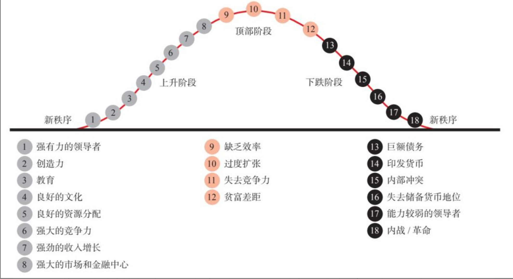

## 2 决定因素

历史就像一台由因果关系驱动的、永不停歇的机器，随着时间的推移，不断演变，周而复始。

### 构建我对永动机的思维模型

自古至今，所有人都有管理人们相处关系的体制或秩序。我把国家内部的体制称为“内部秩序”​，把国家之间的体制称为“外部秩序”​，把适用于全世界的体制称为“世界秩序”​。这些秩序相互影响，而且总在改变。

在我的思维模型中，各种情况的决定因素与其后果之间存在以下的关系。
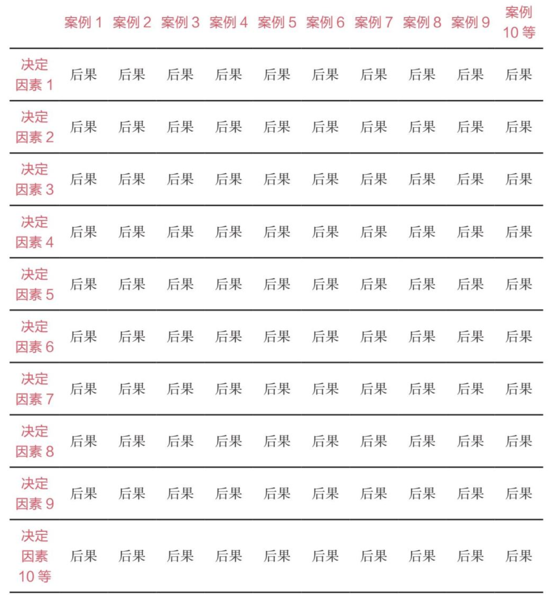

在许多情况下，一些决定因素导致的后果成为其后的决定因素，进而产生其后的后果，这些影响变得相互关联。所以我们可以考察每种情况，分析发生了什么（后果）和为何发生（决定因素）​。我们也可以考察各种决定因素，分析它们在不同情况下产生的后果。决定因素既是现存的事物又是产生变化的能量，就像能量和物质一样，说到底它们是一样的。它们创造了新环境和新的决定因素，从而带来了下一个变化。

### 3、5、8 和 18 个决定因素

三大周期：(1)有利和不利的金融周期（例如资本市场周期）​；(2)内部秩序和混乱周期（取决于合作程度与财富和权力斗争，后者主要缘于财富和价值观差距）​；(3)外部秩序和混乱周期（取决于现有大国在财富和权力斗争中的竞争力）​。

如果这三个周期同时处于有利阶段，国家就会强大而不断崛起；如果这三个周期都处于不利阶段，国家就会疲弱而走向衰落。

另外两个决定因素也值得注意，即(4)创新和技术发展步伐，这有助于人类解决问题和做出改进；及(5)天灾，最重要的是干旱、洪水和疾病。通过创新和技术进步，我们可以解决大多数问题，推动进化过程。历史上的天灾（如干旱、洪水、疾病）都产生了巨大的影响。因此，以上是 5 个最重要的因素，我称之为“五大力量”​。当 5 个决定因素朝着同一个方向出现改善或恶化时，大多数其他因素都会出现相同的走势。

我还介绍了 8 个可以衡量国家实力的指标。这些指标反映且驱动国家实力的上行和下行走势
其他因素，例如地质/地理、法治和基础设施，也很重要。

没有一个决定因素是可以单独决定的，但综合考虑时，它们非常清楚地显示出一个国家在其生命周期所处的位置以及发展方向。
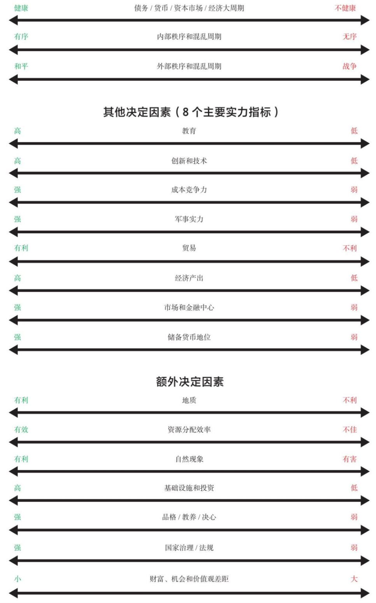

虽然我分别衡量和描述每个决定因素，但它们并不是互不相干的，而是可以相互作用、融合在一起的。它们通常会相互强化，共同决定整个周期的起落。

需要关注的决定因素
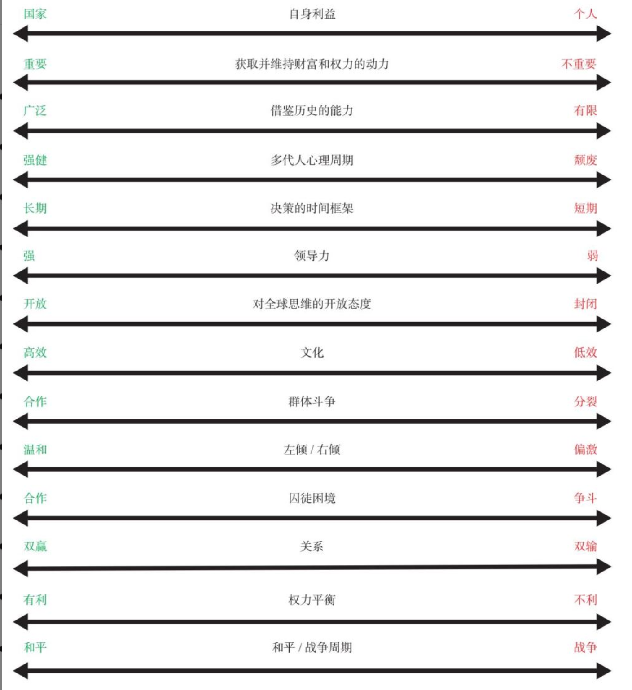

### 探究决定因素和影响机制

驱动事件发生的决定因素和影响机制可以分为两类：

1. 继承的决定因素：所谓继承的决定因素，是指地理、地质、自然现象和系谱。这些因素关系到国家的福祉。
2. 人力资本的决定因素：人们对待自己和彼此的方式。这些因素受人类本性和不同文化的影响（影响方式各不相同）​。

#### 继承的决定因素

1. 地理
2. 地质
3. 天灾
4. 系谱。关于系谱，我不是遗传学专家，只能说来到这个世界的所有人都有遗传基因，这些基因在某种程度上影响人们的行为。因此，一个国家的人口基因构成应该对其结果产生一定的影响。

#### 人力资本的决定因素

虽然一个国家继承的资产和负债非常重要，但历史表明，人们对待自己和他人的方式是最重要的决定因素。● 虽然许多国家都可以利用自己的自然资源，但人力资本是最可持续的资本，因为继承下来的资产最终会消失，而人力资本可以永远存在。

#### 最重要的人性决定因素

5. 自身利益
6. 获得并维持财富和权利的动力
7. 资本市场
8. 借鉴历史的能力
9. 多代人心里周期
10. 将即时满足置于长远福祉之上
11. 人类的创造力

#### 文化形成的决定因素

12. 文化。每个社会的文化都是基于人们对现实世界的看法而形成的，文化提供指导人们应对现实的原则，最重要的是指导人们如何对待彼此的原则。
13. 对全球思维的开放态度。
14. 领导力。在每一代人中，大约有几百人改变了一切。研究这些关键人物所发挥的作用，考察他们在不同情况下所采取的措施和带来的后果，可以帮助我们理解这台永动机的工作原理。

#### 个体和群体相互作用形成的决定因素

15. 贫富差距
16. 价值观差距
17. 群体斗争。自古至今，所有国家的人民都被归入不同“群体”​（尽管程度不同）​，其原因要么是他们选择与自己相似的人在一起，要么是他们被其他人归入特定群体。（人们就是喜欢站队）
18. 左倾/右倾政治周期
19. 要想维系和平，就必须解决囚徒困境。
20. 是双赢关系还是双输关系
21. 权力平衡大周期，它驱动着国家内部和国家之间的和平/战争大周期。
22. 军事实力与和平/战争周期

#### 所有这些因素共同决定内部秩序、外部秩序及其变化

与其他事物一样，内部秩序和世界秩序也在不断演变，将现有情况向前推进；现有情况相互作用，这些作用又产生新的情况。

## 3 货币、信贷、债务和经济活动的大周期

大多数人和他们的国家最希望得到的是财富和权力，而货币和信贷对财富和权力增减的影响最大。如果你不明白货币和信贷是如何运作的，你就无法理解这个系统是如何运作的；如果你不明白这个系统是如何运作的，你就无法了解你即将遇到的情况。

### 货币和信贷的永恒普适的基本要素

● 无论是过去还是现在，所有实体（个人、公司、非营利组织和政府）都要面对同样的基本财务现实。这些实体有资金的流入（即收入）和流出（即支出）​，两者相抵后构成净收入。这些资金流用数字来衡量，显现在损益表中。如果一个实体的收入超过支出，这就会产生利润，储蓄就会增加。如果一个实体的支出超过收入，储蓄就会减少，或者它需要弥补差额，通过借款或以其他方式获得资金。如果一个实体的资产远远超过负债（即拥有高额的净资产）​，它就可以出售资产，使支出超过收入，直到资金耗尽，届时，它必须削减开支。如果一个实体的资产并不比负债多很多，而且收入低于运营和偿债所需的金额，该实体就必须削减开支，否则将会出现违约或者需要重组债务。

● 无论是过去还是现在，所有实体（个人、公司、非营利组织和政府）都要面对同样的基本财务现实。这些实体有资金的流入（即收入）和流出（即支出）​，两者相抵后构成净收入。这些资金流用数字来衡量，显现在损益表中。如果一个实体的收入超过支出，这就会产生利润，储蓄就会增加。如果一个实体的支出超过收入，储蓄就会减少，或者它需要弥补差额，通过借款或以其他方式获得资金。如果一个实体的资产远远超过负债（即拥有高额的净资产）​，它就可以出售资产，使支出超过收入，直到资金耗尽，届时，它必须削减开支。如果一个实体的资产并不比负债多很多，而且收入低于运营和偿债所需的金额，该实体就必须削减开支，否则将会出现违约或者需要重组债务。

● 债务吞噬资产净值。我的意思是，你必须最先偿还债务。例如，如果你拥有一个房子（即拥有“房屋净值”所有权）​，但不能支付抵押贷款，你的房子就会被卖掉或收走。也就是说，债权人比房主优先得到偿付。因此，如果你的收入低于支出，你的资产低于负债（即债务）​，你就不得不卖掉你的资产。

● 债务吞噬资产净值，但央行可以通过印钞来为债务融资。一旦债务危机恶化到一定程度，使吞噬资产净值的大量债务在政治上无法接受，同时带来相应的经济痛苦，政府印钞就不足为奇了。然而，并不是所有政府印制的货币都具有同等的价值。在世界各国被广泛接受的钞票（即货币）被称为储备货币。

● 在储备货币存在期间，拥有储备货币的国家受益匪浅。因为储备货币赋予一个国家极大的借款和消费能力，也给予该国巨大的权力，它能决定哪个国家获得国际交易所需的资金和信贷。

● 拥有储备货币是一个国家所能拥有的最大权力之一，它赋予这

### 货币是什么

货币是一种交换媒介，也可以是财富贮藏的手段。

大多数货币和信贷（尤其是目前存在的法定货币）都没有内在价值。它们只是会计系统中的日记账目，很容易被更改。货币和信贷体系旨在帮助有效分配资源，提高生产率，使借贷双方都能获利，但这一体系会出现周期性失灵。

### 货币、信贷和财富

货币和信贷与财富有关，但它们不是一回事。因为货币和信贷可以用来购买财富（即商品和服务）​，所以一个人拥有的货币和信贷总值与其拥有的财富总值看起来几乎是一样的，但是一个人无法单纯通过创造更多的货币和信贷来创造更多的财富。要想创造更多的财富，就必须提高生产率。货币和信贷创造与财富创造之间的关系经常被混淆，但这种关系是经济周期的最大驱动力。因此我们来详细考察这种关系。

我们可以这样来理解：虽然金融经济和实体经济是相关的，但不能混为一谈。每种经济都存在驱动它的供求关系。

通过增减货币和信贷的供应，央行可以增减金融资产、商品和服务的需求与生产。

我们必须观察实体经济和金融经济的供求变化，以了解金融经济和实体经济可能出现的情况。

就像金融经济和实体经济容易被混淆一样，价格和价值的关系也令人困惑。价格和价值的走势往往相同，所以可能会被混为一谈。因为当人们拥有更多的货币和信贷时，他们就拥有了增加支出的能力和意愿。如果支出增加了经济产出，提高了商品、服务和金融资产的价格，这就相当于增加了财富，因为以我们核算财富的方式来衡量，拥有这些资产的人变得“更富有”了。然而，这种财富增加更多的是种错觉，而不是现实，原因有二：(1)尽管信贷增长推高了价格和生产，但这些信贷是需要偿还的，在所有条件不变的情况下，信贷到期而需要偿还时，会对财富产生反向作用；(2)物品的内在价值不会只因价格上涨而增加。

货币和信贷在发放时产生刺激性影响，而需要偿还时会产生抑制性影响。这就是货币、信贷和经济增长具有周期性的原因。

货币和信贷的控制方（即央行）通过改变货币和信贷的成本与供给来调控市场和整体经济。

你可以这么想：央行有一瓶兴奋剂，可以根据需要将其注入经济。当市场和经济增长下滑时，央行注入货币和信贷兴奋剂，从而提振市场和经济；当市场和经济过热时，央行减少或停止注入兴奋剂。这些举措使货币、信贷、商品、服务和金融资产的数量与价格出现周期性涨跌。这些走势通常表现为短期债务周期和长期债务周期。短期债务周期起起落落，通常持续 8 年左右（会有出入）​。

我称之为短期债务周期，是为了区别于长期债务周期。长期债务周期通常持续 50~100 年（因此包括 6~10 个短期债务周期）​。[插图]长期债务周期在人的一生中只出现一次，大多数人对其会毫无预料。因此其到来往往令人措手不及，让很多人遭受损失。我们正处于长期债务周期的后期阶段，目前的长期债务周期是 1944 年在新罕布什尔州的布雷顿森林设计的世界货币体系的结果，这一货币体系在 1945 年二战结束后付诸实施，标志着美元/美国主导的世界秩序的开始。
当央行无力通过货币和信贷增长来推动实体经济发展时，央行就不具备刺激经济的能力了。

我们从历史案例中可以看到，为了抵消通缩性信贷和经济萎缩带来的通缩影响，中央政府和央行会创造货币和信贷，这样做会削弱自己的货币，推高货币通胀水平。这种情况通常发生在如下时期：债务高企，利率无法充分下调，货币和信贷创造对金融资产价格的提振超过对实体经济活力的提振。这种时候，债务（即其他人交付资金的承诺）持有者通常希望出售持有的货币债务，换成其他形式的财富储备工具。一旦人们普遍意识到，货币和债务资产不再是良好的财富贮藏手段，长期债务周期就走到了尽头，这时需要对货币体系进行结构性重组。

### 长期债务周期

长期债务周期分为 6 个阶段。

1. 第一阶段：最初(a)并不存在债务，或者债务很少，(b)人们使用硬通货。
2. 第二阶段：后来出现了硬通货债权票据（又称票据或纸币）​。
3. 第三阶段：后来是债务增加。起初，硬通货债权票据的数量与银行里储存的硬通货一样多。之后，债权票据的持有者和银行共同发现了信贷和债务的奥妙。一旦出现以下问题，麻烦就来了：人们没有足够的收入来偿还债务，或者人们持有的债权数量（他们指望通过出售这些资产，换来购买商品和服务的货币）比商品和服务数量增长得更快，以致债务资产（如债券）无法兑换成货币以购买商品和服务。而这两个问题往往结伴而来。
4. 第四阶段：然后会发生债务危机、违约和货币贬值，导致印钞和与硬通货脱钩。当私人银行陷入困境时，它们只能选择违约，或接受政府纾困。对央行而言，如果债务是以本国货币计价的，那么央行可以降低债权价值（例如，偿付 50%~70%）​，但如果债务以自己无法印制的货币计价，那么最终央行也只得违约。
5. 第五阶段：然后是法定货币，最终导致货币贬值。当信贷周期达到极限时，为了维持经济运行，中央政府及央行会创造大量债务，还会印钞，并用于购买商品、服务和投资资产，这是合乎逻辑的典型对策。

● 我们不应该依靠政府来保护钱财。

● 当政府能够创造货币和信贷，并发放给民众而取得好评时，政府很难抵抗这种诱惑。这种印钞购债做法（称为“债务货币化”​）将财富从富人转移到有需要的群体。从政治角度来说，这比征税容易接受多了（因为征税会得罪纳税人）​。这就是为什么央行最终会选择印钞，并让货币贬值。当政府大量印钞和购债时，货币和债务的价值就会下降。这实质上是对货币和债券持有人征税，减轻债务人和借款人的负担。这种情况发展到一定程度时，货币和债务资产持有者就会意识到真实情况。于是，他们设法出售债务资产和/或借入廉价贷款，再举借可以通过廉价贷款来偿还的债务。他们还常常把财富转移到其他财富贮藏手段上，比如黄金、某些类别的股票或没有这些问题的其他国家。在这种情况下，央行通常会继续印钞，直接或间接地购买债券（例如，让银行代其购买）​，并禁止资金流入通胀对冲资产、其他货币和其他地方。尽管人们趋于相信货币基本上会永远存在，​“现金”是可以持有的最安全的资产，但是事实并非如此。

● 所有货币都会贬值甚至消亡。一旦出现这种情况，现金和债券（即获得货币的承诺）就会贬值甚至变得一文不值。这是因为大规模印钞、降低债务价值是减轻或消除债务负担的最简便方式。

要想使债务和负债相对于偿债所需的收入和现金流下降，决策者可以使用以下 4 种工具：1.财政紧缩（减少支出）​；2.债务违约和重组；3.将资金和信贷从富人向贫困者转移（例如，增税）​；4.印钞并使货币贬值。● 印钞是最简便、最不被人了解、最常见的主要债务重组手段。

6. 第六阶段：回归硬通货。在极端情况下，如果做得太过火了，就是说央行过度增印法定货币，债权人就会出售债务资产，引发上文所述的银行挤兑现象，最终导致货币和信贷的价值下降，促使人们逃离现金和债务（如债券）​。如果货币贬值和债务违约变得过于极端，货币和信贷体系就会崩溃。届时，政府通常会被迫回归某种形式的硬通货，重建人们对货币价值作为财富贮藏手段的信心。

综上所述，在长期债务周期的早期，未偿债务不多，持有赚取利息的债务资产通常带来回报。但是，到了周期的后期，未偿债务大量积累，濒临违约或者贬值，持有债务的风险超过所得的利息。

这些债务累积和债务勾销周期已经存在了几千年.具有讽刺意味的是，对大多数人来说，债务越濒临崩溃（此时的未偿债权与硬通货和有形财富的比率最大）​，境况越危险，人们往往越感觉安全。这是因为他们一直持有债务，享受着债务带来的回报，而距离上一次债务危机的时间越长，人们对它的记忆就越淡，尽管持有债务的风险上升、回报下降。

### 长期债务周期小结

几千年来，世界上一直存在三种类型的货币体系。第一类：硬通货（如金属硬币）​。第二类：纸币（硬通货债权）​。第三类：法定货币。硬通货是最具约束性的货币体系。除非作为货币的金属或其他具有内在价值的大宗商品的供给增加，否则货币无法创造。在第二类货币体系中，货币和信贷更容易创造，因而硬通货债权与实际持有的硬通货的比率会上升，最终导致银行发生“挤兑”​。结果是违约，银行关门，储户失去他们的硬资产和/或货币债权贬值，这意味着储户拿回来的钱少了。在第三类货币体系中，政府可以自由创造货币和信贷，只要人们对货币还有信心，这种体系就一直运营；一旦人们对货币失去信心，这种体系就会失灵。
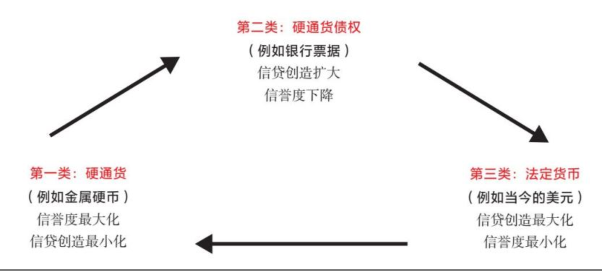
这一债务大周期通常持续 50~100 年，以债务重组和货币体系本身重组而结束。重组过程中的突发阶段（即债务和货币危机时期）通常很短，只持续几个月到三年，时间的长短取决于政府的行动速度。然而，这些重组带来的连锁效应可能是持久的。例如，一种货币失去储备货币地位时，其影响是深远的。

## 4 货币价值的演变

如前所述，说到经济，既有实体经济，也有金融经济，二者紧密相连，却不一样。实体经济和金融经济拥有各自的供需机制。
大多数人担心他们的资产价值是在上升还是在下降，却很少注意其货币是在升值还是在贬值。

### 所有货币都出现过贬值，甚至消亡

1700 年以来，世界上存在过大约 750 种货币，其中只有约 20%的货币目前仍然存在，这些货币均出现过贬值。

### 货币相对于什么出现贬值

印钞的目的是减轻债务负担，因此最重要的是货币对债务的贬值（即让货币数量相对于债务数量增加，使债务人更容易偿还债务）​。债务是对未来交付资金的承诺，因此给需要资金的人提供更多的资金，就能减轻他们的债务负担。

一旦货币的创造严重损害现金和债务资产的实际和预期回报率，这就会导致资金流出这些资产，流入通胀对冲资产，例如黄金、大宗商品、通胀指数债券和其他货币（包括数字货币）​。这将导致货币价值加速下跌。

有的货币贬值有利于体系（但货币和债务持有者总是需要付出高昂代价）​，而有的货币贬值则有害于体系，这种货币贬值会破坏信贷/资本分配体系，但它是消除债务以建立货币新秩序的必要举措。搞清二者的差别非常重要。

为此，我先来讲述货币相对于黄金和按消费者价格指数加权的一揽子商品和服务的价值如何发生变化。二者具有可比性，因为黄金是永恒普适的替代货币，而货币是用来购买商品和服务的，因此货币的购买力是最重要的。我还会简要分析货币价值相对于其他货币/债务以及股票的变化，因为这些资产也可以成为财富贮藏手段。

### 货币对于黄金的价值

下图显示 1600 年以来三大主要储备货币相对于黄金的现汇汇率。我们稍后将会对此进行深入考察。储备货币对黄金（现汇汇率
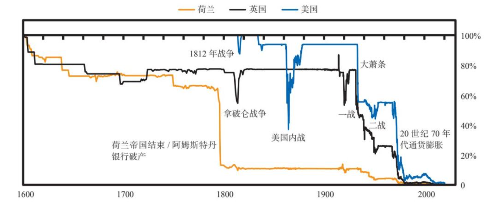

如下图所示，货币贬值通常相当突然地发生在债务危机期间，而两次债务危机之间是较长的繁荣稳定时期。我注意到主要货币的 6 次大幅贬值。

现汇汇率对黄金
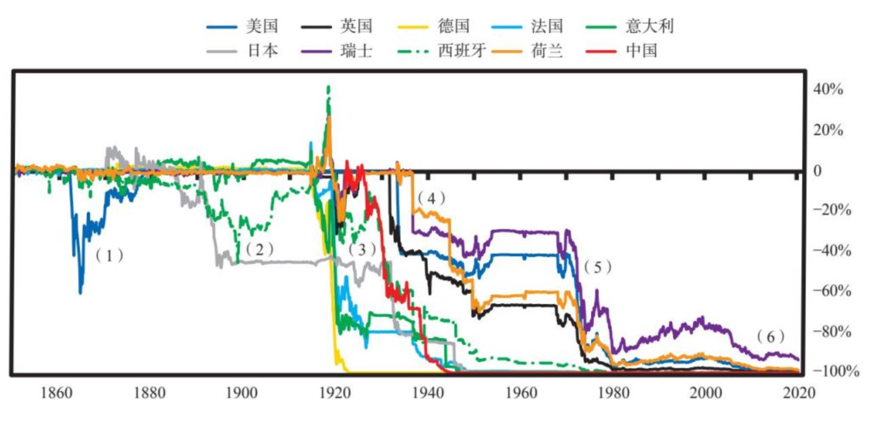

外汇总回报率对黄金（取对数值）
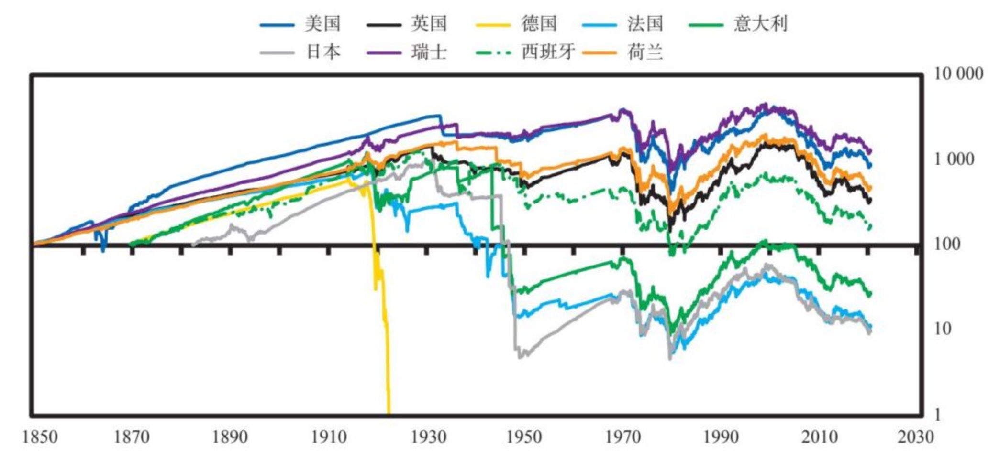

以下是值得注意的要点。

• 货币大幅贬值往往具有突发性和偶发性，而非逐渐演变而成。

• 2000 年以来，货币相对于黄金贬值，原因有二：一是大规模货币和信贷创造，二是利率相对于通胀率保持在低位。由于货币体系允许汇率自由浮动，因此没有发生过以前那样的突然中断，货币价值只是在缓慢且持续地下降。低利率（有些情况下甚至是负利率）没有为货币和信贷增长以及由此引发的通胀（尽管程度较轻）提供补偿。

1850 年以来主要国家的货币和黄金的实际回报率（相对于消费者价格指数，年率）
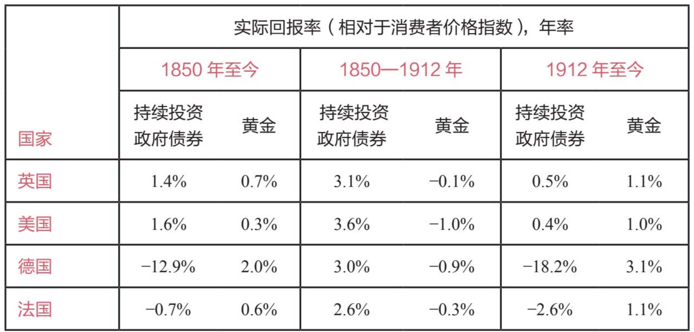
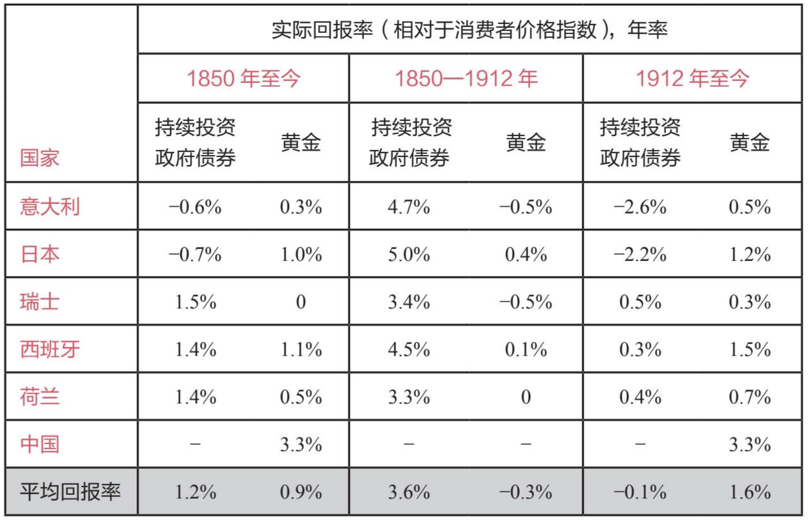

### 货币相对于商品和服务的价值

历史告诉我们，特别是在债务周期后期阶段，将赚取利息的现金货币作为财富贮藏手段存在巨大风险。

纸币的实际回报率（相对于消费者价格指数）
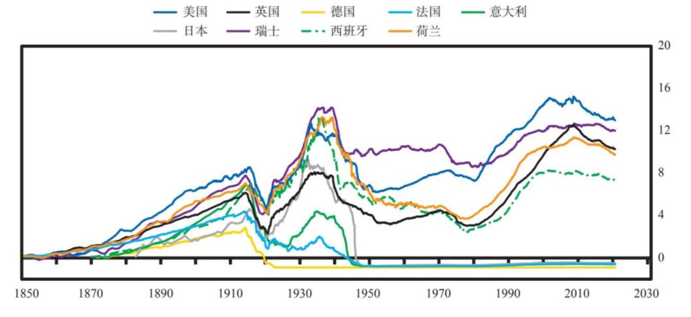

### 国家货币贬值并失去储备货币地位的典型模式

货币贬值与货币失去储备货币地位不一定是一回事，即便两者都是债务危机造成的。失去储备货币地位是长期大规模货币贬值的结果。

这些货币贬值具有哪些共性？

• 在第二部分深入考察的主要案例中，所有经济体都出现过典型的挤兑现象，即央行发行的债权票据总额超过可供提取的硬通货总额。

• 央行的净储备在实际贬值前就已开始减少，在某些央行，甚至在货币贬值前几年就开始减少。

• 货币挤兑和贬值的出现通常伴随着严重的债务问题

• 通常来说，央行最初的反应是，提高短期利率，但从经济角度看，这种做法过于痛苦，因此央行很快会放弃这种做法，转而增加货币供应。

• 不同国家的结果截然不同，一个重要变量是，该国在货币贬值时保存了多少经济和军事实力。

<!-- Giscus 评论区 -->

